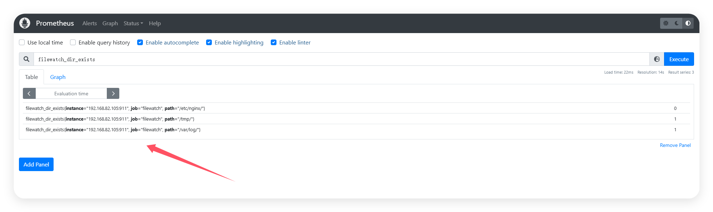
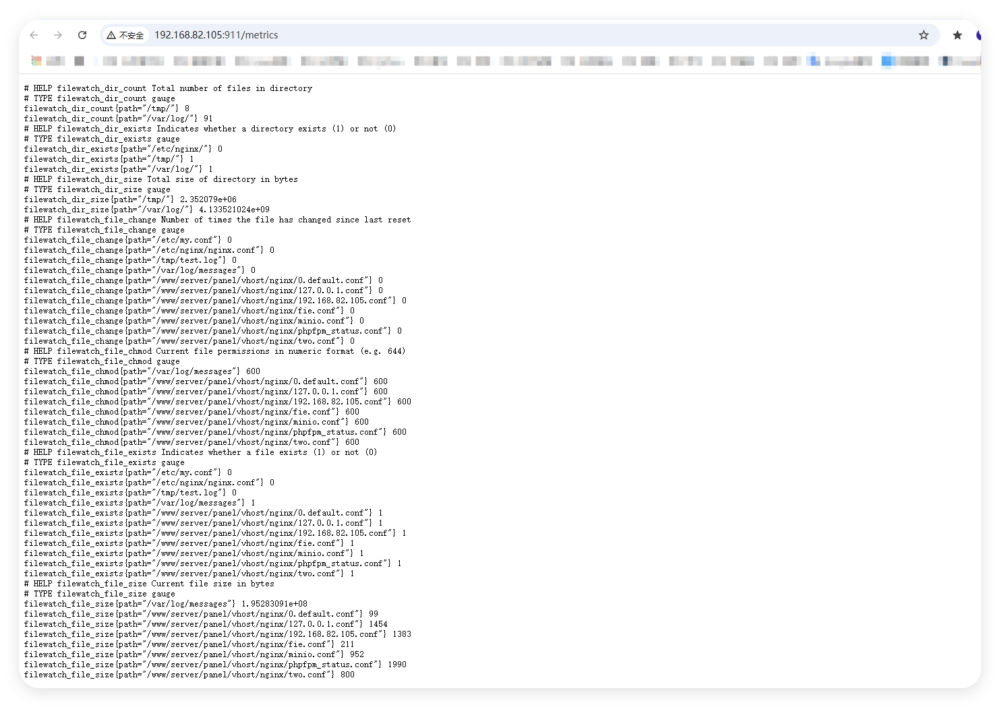
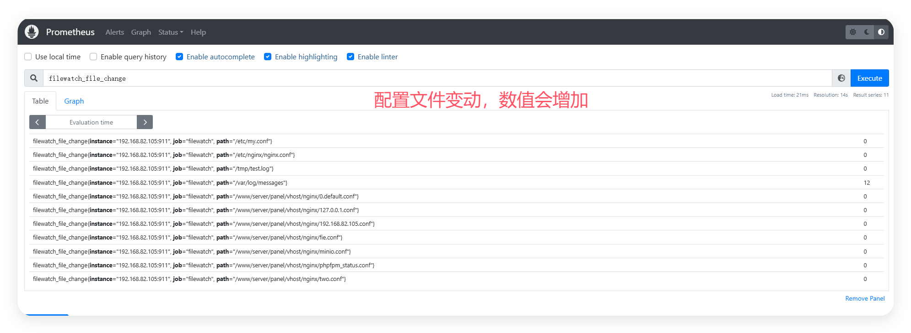
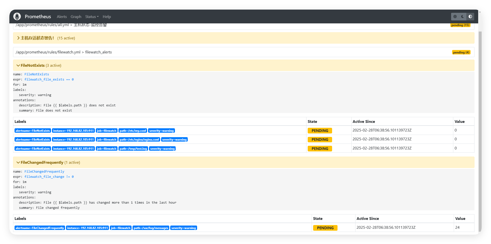
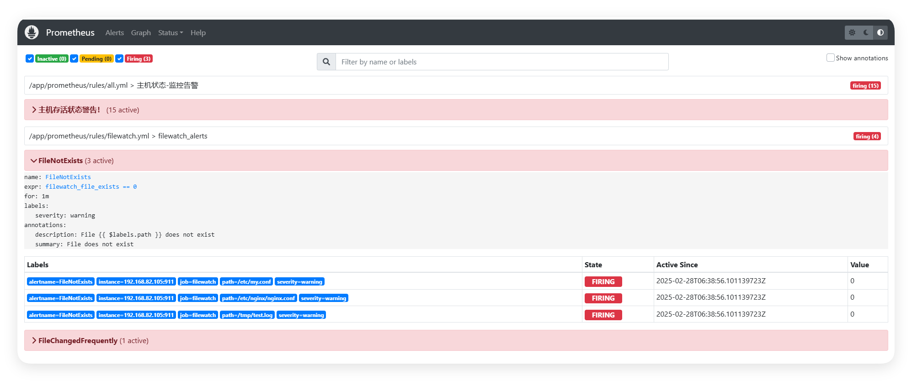

# File Watch Exporter

File Watch Exporter 是一个用于监控文件和目录状态的 Prometheus exporter。它可以监控文件的存在性、变化、权限、大小，以及目录的存在性、大小和文件数量等指标。




## 功能特性

### 文件监控
- 文件存在性监控 (`filewatch_file_exists`)
- 文件内容变化计数 (`filewatch_file_change`)
- 文件权限监控 (`filewatch_file_chmod`)
- 文件大小监控 (`filewatch_file_size`)
- 支持文件路径通配符匹配 (例如: `*.log`, `*.conf`)

### 目录监控
- 目录存在性监控 (`filewatch_dir_exists`)
- 目录总大小监控 (`filewatch_dir_size`)
- 目录文件数量统计 (`filewatch_dir_count`)

### 其他特性
- 自动定期检查更新
- 可配置的检查间隔
- 可配置的计数器重置间隔
- 详细的日志记录
- 优雅的错误处理
- Web UI 界面

## 技术选型


### 基础框架
- 开发语言: Go 1.23+
- 依赖管理: Go Modules

## 快速开始
### 安装

```bash
# 克隆仓库
git clone https://github.com/nangongchengfeng/filewatch_exporter.git

# 进入项目目录
cd filewatch_exporter

# 构建
SET CGO_ENABLED=0&&SET GOOS=linux&&SET GOARCH=amd64&& go build -o filewatch_exporter  ./main.go

# 启动
./filewatch_exporter -config=config.yaml

[root@prometheus-server target]# ./filewatch_exporter -config=config.yaml
使用的配置文件: config.yaml
2025/02/28 15:25:28 New file matched by pattern /www/server/panel/vhost/nginx/*.conf: /www/server/panel/vhost/nginx/0.default.conf
2025/02/28 15:25:28 New file matched by pattern /www/server/panel/vhost/nginx/*.conf: /www/server/panel/vhost/nginx/127.0.0.1.conf
2025/02/28 15:25:28 New file matched by pattern /www/server/panel/vhost/nginx/*.conf: /www/server/panel/vhost/nginx/192.168.82.105.conf
2025/02/28 15:25:28 New file matched by pattern /www/server/panel/vhost/nginx/*.conf: /www/server/panel/vhost/nginx/fie.conf
2025/02/28 15:25:28 New file matched by pattern /www/server/panel/vhost/nginx/*.conf: /www/server/panel/vhost/nginx/minio.conf
2025/02/28 15:25:28 New file matched by pattern /www/server/panel/vhost/nginx/*.conf: /www/server/panel/vhost/nginx/phpfpm_status.conf
2025/02/28 15:25:28 New file matched by pattern /www/server/panel/vhost/nginx/*.conf: /www/server/panel/vhost/nginx/two.conf


go build
```

### 配置

创建配置文件 `config/config.yaml`:

```yaml
# 服务器配置
server:
  listen_address: ":9100"  # 监听地址和端口
  metrics_path: "/metrics" # 指标路径

# 监控的文件列表
files:
  - "/etc/nginx/nginx.conf"
  - "/var/log/syslog"
  - "/etc/nginx/conf.d/*.conf"  # 支持通配符
  - "logs/*.log"

# 监控的目录列表
dirs:
  - "/etc/nginx/"
  - "/var/log/"
  - "/tmp/"

# 检查间隔（秒）
check_interval_seconds: 30

# 重置间隔（分钟）
reset_interval_minutes: 30
```

### 运行

```bash
./filewatch_exporter
```

## 指标说明

### 文件指标

1. `filewatch_file_exists{path="/path/to/file"}`
   - 类型: Gauge
   - 描述: 指示文件是否存在
   - 值: 1 (存在) 或 0 (不存在)

2. `filewatch_file_change{path="/path/to/file"}`
   - 类型: Gauge
   - 描述: 文件内容变化的次数
   - 值: 0 ~ N (变化次数)

3. `filewatch_file_chmod{path="/path/to/file"}`
   - 类型: Gauge
   - 描述: 文件的权限值（八进制）
   - 值: 例如 644, 755 等

4. `filewatch_file_size{path="/path/to/file"}`
   - 类型: Gauge
   - 描述: 文件大小（字节）
   - 值: >= 0

### 目录指标

1. `filewatch_dir_exists{path="/path/to/dir"}`
   - 类型: Gauge
   - 描述: 指示目录是否存在
   - 值: 1 (存在) 或 0 (不存在)

2. `filewatch_dir_size{path="/path/to/dir"}`
   - 类型: Gauge
   - 描述: 目录总大小（字节）
   - 值: >= 0

3. `filewatch_dir_count{path="/path/to/dir"}`
   - 类型: Gauge
   - 描述: 目录中的文件总数
   - 值: >= 0

## Prometheus 配置

将以下配置添加到 Prometheus 的 `prometheus.yml`:

```yaml
scrape_configs:
  - job_name: 'filewatch'
    static_configs:
      - targets: ['localhost:9100']
```

## 告警规则示例





```yaml
groups:
- name: filewatch_alerts
  rules:
  - alert: FileNotExists
    expr: filewatch_file_exists == 0
    for: 5m
    labels:
      severity: warning
    annotations:
      summary: "File does not exist"
      description: "File {{ $labels.path }} does not exist"

  - alert: FileChangedFrequently
    expr: rate(filewatch_file_change[1h]) > 10
    for: 15m
    labels:
      severity: warning
    annotations:
      summary: "File changed frequently"
      description: "File {{ $labels.path }} has changed more than 10 times in the last hour"

  - alert: DirectorySize
    expr: filewatch_dir_size > 1e9
    for: 1h
    labels:
      severity: warning
    annotations:
      summary: "Directory size exceeds 1GB"
      description: "Directory {{ $labels.path }} size is {{ $value }} bytes"
```

## 错误处理

- 文件/目录不存在时会记录到日志
- 权限错误会被记录但不会中断监控
- 所有错误都会在日志中详细记录

## Web UI

访问 `http://localhost:9100` 可以看到:
- 当前监控的文件列表
- 当前监控的目录列表
- 指标访问链接

## 性能考虑

- 使用互斥锁保护并发访问
- 高效的文件系统遍历
- 可配置的检查间隔
- 优化的内存使用

## 贡献

欢迎提交 Issue 和 Pull Request！

## 许可证

MIT License

## 作者

南宫乘风
Email: 1794748404@qq.com
